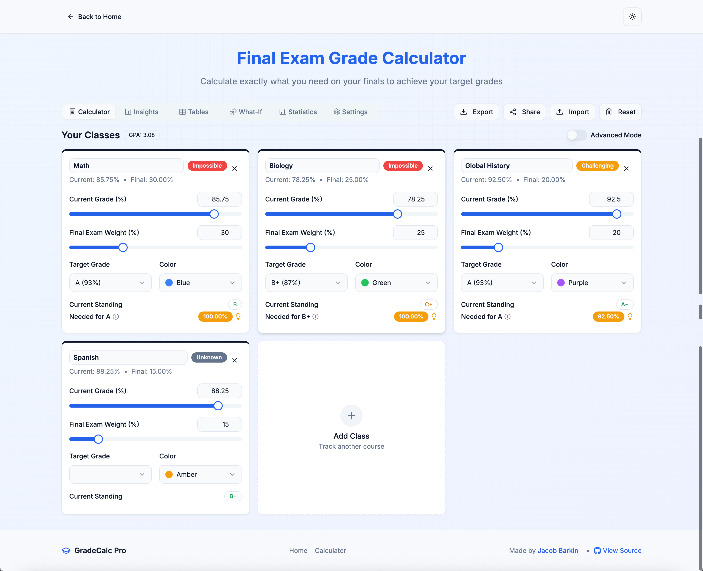

# Final Exam Grade Calculator

[](https://nextjs.org/)
[](https://tailwindcss.com/)
[](https://pages.cloudflare.com/)

A powerful and intuitive web application that helps students calculate what they need on their final exams to achieve their target grades. This tool provides comprehensive grade analysis, visualizations, and advanced what-if scenarios to help students plan their study strategies effectively. Now featuring enhanced analytics, mobile optimization, and intelligent user guidance.



## 🌟 Features

### Core Functionality
- **Precise Grade Calculation**: Calculate the minimum score needed on final exams to achieve target grades
- **Multiple Classes**: Track and manage grades for multiple courses simultaneously with color coding
- **Smart Rounding**: Optional rounding for final grades while maintaining calculation accuracy
- **Assignment Tracking**: Detailed assignment management with weights and scores

### Advanced Analytics
- **Visual Analytics**: Interactive charts and graphs to visualize grade distributions and scenarios
- **Enhanced What-If Scenarios**:
  - Target Achievement Analysis with difficulty indicators
  - Grade Improvement Scenarios
  - Risk Assessment for different performance levels
  - Dual input controls (sliders + numerical inputs for precision)
- **Comprehensive Statistics**: Statistical analysis with user-friendly explanations
- **Grade Comparison**: Cross-class performance analysis and trends

### User Experience
- **Intuitive Interface**: Educational explanations and contextual help throughout the app
- **Page Synchronization**: Smart navigation that remembers your context between pages
- **Data Import/Export**: Save and load your grade data with JSON export/import functionality
- **Responsive Design**: Works seamlessly on desktop, tablet, and mobile devices with touch optimizations
- **PWA Support**: Install as a native app with offline functionality
- **Dark Mode Support**: Toggle between light and dark themes with system preference detection
- **Local Storage**: Your data is saved locally in your browser for privacy and convenience

## 🚀 Technologies Used

- **Frontend Framework**: [Next.js](https://nextjs.org/) (React 19)
- **Styling**: [Tailwind CSS](https://tailwindcss.com/) with [shadcn/ui](https://ui.shadcn.com/) components
- **Charts & Visualizations**: [Recharts](https://recharts.org/)
- **Animations**: [Framer Motion](https://www.framer.com/motion/)
- **Icons**: [Lucide React](https://lucide.dev/)
- **Form Handling**: [React Hook Form](https://react-hook-form.com/) with [Zod](https://zod.dev/) validation
- **Deployment**: [Cloudflare Pages](https://pages.cloudflare.com/)

## 📋 Prerequisites

- [Node.js](https://nodejs.org/) (v18 or higher)
- [npm](https://www.npmjs.com/), [yarn](https://yarnpkg.com/), or [pnpm](https://pnpm.io/) package manager

## 🛠️ Installation & Setup

1. **Clone the repository**

```bash
git clone https://github.com/JSB2010/final-exam-grade-calculator.git
cd final-exam-grade-calculator
```

2. **Install dependencies**

```bash
# Using npm
npm install

# Using yarn
yarn install

# Using pnpm
pnpm install
```

3. **Run the development server**

```bash
# Using npm
npm run dev

# Using yarn
yarn dev

# Using pnpm
pnpm dev
```

4. **Open your browser**

Navigate to [http://localhost:3000](http://localhost:3000) to see the application running.

## 🔧 Usage

1. **Add your classes** by clicking the "Add Class" card
2. **Enter your current grades** and final exam weights for each class
3. **Set target grades** to see what you need to score on finals
4. **Explore the insights tab** for detailed grade analysis and visualizations
5. **Use the tables tab** to view comprehensive grade tables and what-if scenarios
6. **Customize settings** in the settings tab to adjust display preferences
7. **Export your data** to save your progress or share with others

## 📚 Canvas LMS Integration

1. Click **Import from LMS** and choose **Canvas**.
2. Select **Kent Denver School** or enter your own Canvas URL.
3. Paste your Canvas access token.

### Creating a Canvas access token

1. Log in to Canvas and open **Account → Settings**.
2. Scroll to **Approved Integrations** and click **New Access Token**.
3. Give the token a name and optional expiration date.
4. Click **Generate Token** and copy the value shown.
5. Paste this token in the import dialog.

## 📊 Grade Calculation Logic

The application uses the following formula to calculate the required score on a final exam:

```
Required Score = (Target Grade - (Current Grade × (1 - Final Weight/100))) / (Final Weight/100)
```

Where:
- **Target Grade**: The minimum grade you want to achieve in the class
- **Current Grade**: Your current grade before the final exam
- **Final Weight**: The percentage weight of the final exam in your overall grade

## 🆕 Recent Improvements

### Version 2.0 Features
- **Enhanced What-If Scenarios**: Added contextual explanations, difficulty indicators, and dual input controls
- **Improved Statistics**: User-friendly language and comprehensive explanations for all metrics
- **Page Synchronization**: Smart navigation that remembers your context between insights and tables
- **Mobile Optimization**: Better touch interactions and responsive design improvements
- **UI/UX Polish**: Consistent styling, better visual hierarchy, and professional appearance
- **Code Quality**: Resolved all linting issues and improved performance

### Bug Fixes
- Fixed hydration errors for better SSR compatibility
- Resolved card overflow issues in insights page
- Corrected rounding functionality to only affect final grades
- Improved responsive layout for equal-height cards

## 🚢 Deployment

### Deploying to Cloudflare Pages

1. **Fork or clone this repository** to your GitHub account

2. **Sign in to Cloudflare Pages** at [https://pages.cloudflare.com/](https://pages.cloudflare.com/)

3. **Create a new project** and connect your GitHub repository

4. **Configure your build settings**:
   - **Framework preset**: Next.js
   - **Build command**: `npm run build`
   - **Build output directory**: `.next`
   - **Environment variables**: Add any necessary environment variables

5. **Deploy your site** by clicking "Save and Deploy"

6. **Your site will be live** at the provided Cloudflare Pages URL

## 🤝 Contributing

Contributions are welcome! Please feel free to submit a Pull Request.

1. Fork the repository
2. Create your feature branch (`git checkout -b feature/amazing-feature`)
3. Commit your changes (`git commit -m 'Add some amazing feature'`)
4. Push to the branch (`git push origin feature/amazing-feature`)
5. Open a Pull Request

## 👨‍💻 Author

**Jacob Barkin**
- Website: [jacobbarkin.com](https://jacobbarkin.com)
- GitHub: [@JSB2010](https://github.com/JSB2010)

## 📝 License

This project is licensed under the MIT License - see the [LICENSE](LICENSE) file for details.

## 🙏 Acknowledgements

- [shadcn/ui](https://ui.shadcn.com/) for the beautiful UI components
- [Tailwind CSS](https://tailwindcss.com/) for the utility-first CSS framework
- [Next.js](https://nextjs.org/) for the React framework
- [Recharts](https://recharts.org/) for the charting library
- [Framer Motion](https://www.framer.com/motion/) for the animations
- [Lucide React](https://lucide.dev/) for the icons